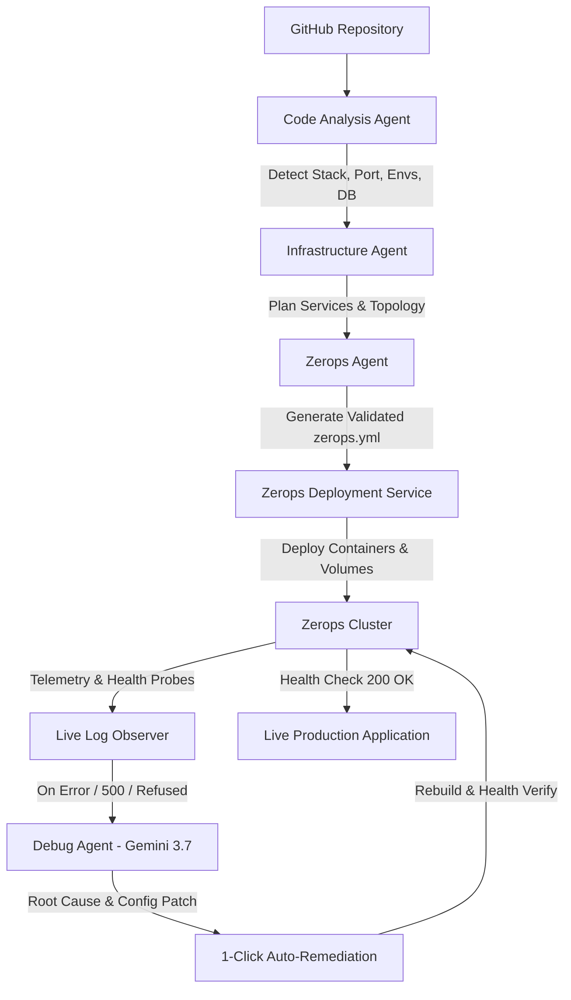

# DeployMate AI 🚀
### AI-Powered Intelligent Application Deployment & Troubleshooting Agent

> **Project:** Intelligent Multi-Agent Cloud Deployment Pipeline  
> **Repository:** [Tanya-garg10/DeployMate-AI](https://github.com/Tanya-garg10/DeployMate-AI)  
> **Infrastructure Platform:** [Zerops](https://zerops.io)

---

## 💡 Executive Summary & Core Idea

Deploying modern cloud applications across microservices, databases, and container runtimes remains error-prone and developer-intensive. Configuration drift, missing environment variables, port mismatches, and ambiguous runtime logs often cause deployments to fail at runtime.

**DeployMate AI** transforms cloud deployments into an autonomous, intelligent multi-agent pipeline:

$$\text{PLAN} \longrightarrow \text{ACT} \longrightarrow \text{OBSERVE} \longrightarrow \text{DIAGNOSE} \longrightarrow \text{RECOVER}$$

From analyzing public or private GitHub repositories to provisioning Zerops infrastructure, generating optimized `zerops.yml` specifications, streaming live container telemetry, and performing root-cause remediation, DeployMate AI delivers a production-grade experience for developers and DevOps engineers.

---

## 🏗 Multi-Agent Architecture



### Logical Agent Breakdown

1. **Code Analysis Agent** (`server/agents/code_analysis_agent.ts` & `backend/agents/code_analysis_agent.py`)
   - Deeply inspects repository trees, `package.json`, `requirements.txt`, `pyproject.toml`, `.env.example`, `Dockerfile`, and configuration files.
   - Detects frameworks (FastAPI, Next.js, React/Vite, Node.js, Django, Flask), package managers (`pip`, `npm`, `pnpm`, `bun`), port mappings, and required environment variables.
   - Computes a deterministic confidence rating based on source-code ground truth combined with Gemini 3.7 semantic code reasoning.

2. **Infrastructure Agent** (`server/agents/infrastructure_agent.ts` & `backend/agents/infrastructure_agent.py`)
   - Designs multi-tier cloud topologies (Frontend, Backend API, Zerops Managed PostgreSQL / Redis).
   - Generates CPU, RAM, and scaling recommendations with DevOps justifications.

3. **Zerops Agent** (`server/agents/zerops_agent.ts` & `backend/agents/zerops_agent.py`)
   - Generates valid, production-ready `zerops.yml` configurations with multi-stage build caching, deploy files, environment variables, and HTTP health check endpoints.

4. **Deployment & Telemetry Service** (`server/services/zerops_service.ts` & `backend/services/zerops_service.py`)
   - Manages container lifecycle states: `QUEUED` → `BUILDING` → `DEPLOYING` → `RUNNING` / `FAILED` → `RECOVERING`.
   - Streams color-coded terminal logs and health probes.

5. **Debug Agent (Killer Feature)** (`server/agents/debug_agent.ts` & `backend/agents/debug_agent.py`)
   - Evaluates failed runtime logs, container exit codes, and architecture context using Gemini 3.7.
   - Identifies root causes (e.g. missing `DATABASE_URL`, `127.0.0.1` vs `0.0.0.0` ingress binding, missing package dependencies).
   - Formulates concrete configuration patches and triggers **1-Click Auto-Remediation**.

---

## ⚡ Tech Stack

- **Frontend:** React 19, TypeScript, Vite, Tailwind CSS, Lucide Icons, Motion, Canvas-Confetti
- **Backend:** Express & Node.js (Full-stack Server with tsx and Vite middleware) + FastAPI / Python 3.12 reference implementation
- **AI Engine:** Google Gemini 3.7 Flash via `@google/genai`
- **Target Cloud Infrastructure:** [Zerops](https://zerops.io) (`zerops.yml`, Zerops API/CLI integration)
- **Database:** Zerops Managed PostgreSQL 16
- **Repository Integration:** GitHub REST API v3

---

## 🛠 Local Setup & Running

### Prerequisites
- Node.js >= 20.x
- Python 3.12 (optional, for standalone FastAPI backend)
- Gemini API Key (`GEMINI_API_KEY`)

### 1. Installation
```bash
# Clone the repository
git clone https://github.com/Tanya-garg10/DeployMate-AI.git
cd DeployMate-AI

# Install Node dependencies
npm install
```

### 2. Environment Variables Configuration
Copy `.env.example` to `.env`:
```bash
cp .env.example .env
```
Populate `.env`:
```env
GEMINI_API_KEY="your-gemini-api-key"
ZEROPS_API_TOKEN=""      # Optional: Zerops API token for live deployments (defaults to simulation sandbox)
GITHUB_TOKEN=""          # Optional: GitHub token for higher API rate limits
```

### 3. Run Development Server
```bash
npm run dev
```
The application will be accessible at `http://localhost:3000`.

---

## 🚀 Zerops Production Deployment

DeployMate AI includes pre-configured `zerops.yml` files for deploying directly to Zerops:

```yaml
zerops:
  - setup: app
    build:
      base: nodejs@20
      buildCommands:
        - npm ci
        - npm run build
      deployFiles:
        - dist
        - package.json
        - package-lock.json
        - node_modules
      cache:
        - node_modules
    run:
      base: nodejs@20
      ports:
        - port: 3000
          httpSupport: true
      envVariables:
        GEMINI_API_KEY: "${geminiApiKey}"
        ZEROPS_API_TOKEN: "${zeropsApiToken}"
        NODE_ENV: "production"
      start: node dist/server.cjs
      healthCheck:
        httpGet:
          port: 3000
          path: /health
```

---

## 📡 REST API Reference

| Endpoint | Method | Description |
|---|---|---|
| `/health` | `GET` | Health check endpoint returning `{ status: "healthy", service: "DeployMate AI" }` |
| `/api/analyze` | `POST` | Inspects GitHub repository files, framework, language, dependencies, and environment variables |
| `/api/generate-plan` | `POST` | Infrastructure Agent creates multi-tier Zerops service topology |
| `/api/generate-config` | `POST` | Zerops Agent generates validated `zerops.yml` |
| `/api/deploy` | `POST` | Triggers container build and deployment pipeline |
| `/api/deployments` | `GET` | Lists all historical and active deployments |
| `/api/deployments/:id` | `GET` | Retrieves deployment status, timeline, and metadata |
| `/api/deployments/:id/logs` | `GET` | Streams console terminal logs |
| `/api/deployments/:id/diagnose`| `POST` | Triggers AI Debug Agent to diagnose root-cause on failed deployment |
| `/api/deployments/:id/apply-fix`| `POST` | Applies AI recommended fix, patches config, and executes auto-redeploy |

---

## 🎯 Step-by-Step Judge Demo Workflow

To verify the complete functionality during the hackathon evaluation:

1. **Launch App**: Open the dashboard at `http://localhost:3000`.
2. **Select / Input Repository**: Click the preset `DeployMate AI (Hackathon Project)` or paste `https://github.com/Tanya-garg10/DeployMate-AI`.
3. **Analyze**: Click **[ Analyze Project ]**. The **Code Analysis Agent** will inspect the manifest, identify `FastAPI + Python + PostgreSQL`, detect ports, and show confidence metrics.
4. **Plan & YAML**: Click **[ Generate Zerops Topology ]**. Review the visual topology graph (API → PostgreSQL) and inspect the generated `zerops.yml`.
5. **Simulate Error**: In the Top Demo Bar, click **[ 2. Missing DATABASE_URL Error & AI Recovery ]** and deploy.
6. **Observe Failure**: Watch the terminal console log stream until `Health check failed` (Exit status 1).
7. **AI Diagnosis (Killer Feature)**: Click **[ View AI Diagnosis & Auto-Fix ]**. The **Debug Agent** will identify the exact missing environment variable, impact, and severity with a 96%+ confidence score.
8. **Auto-Remediate & Redeploy**: Click **[ Apply Fix & Redeploy ]**. The agent auto-injects the credentials, regenerates the verified config, rebuilds the container, and achieves a **Health check HTTP 200 OK** live status!

---

## 🔒 Security & Best Practices

- **Zero Client-Side Secrets**: All Gemini API keys, GitHub tokens, and Zerops credentials remain strictly server-side.
- **Safe Command Safeguards**: No arbitrary shell command injection is allowed.
- **Explicit Mode Indicator**: The UI strictly separates Live Zerops deployments from Simulated Test Sandboxes.

---

## 🌟 Future Scope

- Direct Webhook integration with GitHub / GitLab for automatic Git push triggers.
- Support for distributed multi-region Kubernetes clusters with auto-failover.
- Proactive canary deployments and performance anomaly detection.
